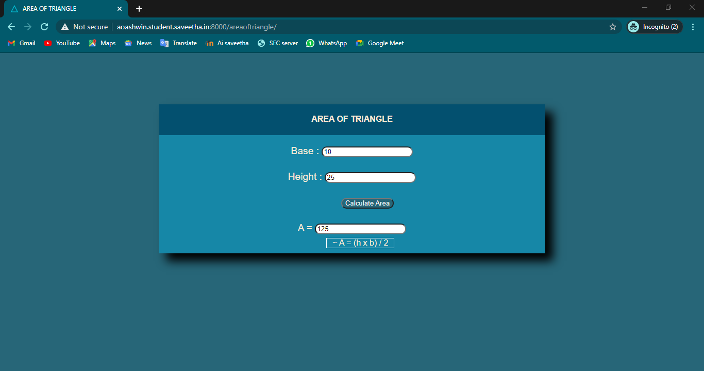

# Mathematical Calculations using JavaScript

### Webpage URL (cylinder volume): http://aoashwin.student.saveetha.in:8000/cylindervolume/
### Webpage URL (area of triangle): http://aoashwin.student.saveetha.in:8000/areaoftriangle/

### Git Repository : https://github.com/aoashwin/scriptproject.git

## AIM:
To design a website to calculate the area of a triangle and volume of a cylinder using JavaScript.

## DESIGN STEPS:
### Step 1: 
Requirement collection.
### Step 2:
Creating the layout using HTML and CSS.
### Step 3:
Write JavaScript to perform calculations.
### Step 4:
Choose the appropriate style and color scheme.
### Step 5:
Validate the layout in various browsers.
### Step 6:
Validate the HTML code.
### Step 6:
Publish the website in the given URL.


## PROGRAM:

### areaoftriangle.html
```

<!DOCTYPE html>
<html>

<head>
    <title>AREA OF TRIANGLE</title>
    <link rel="stylesheet" href="">
    <link rel="icon" href="" type="image/x-icon">
</head>

<body>
    <div class="container">
        <div class="formview">
            <div class="banner">
                <b>AREA OF TRIANGLE</b>
            </div>
            <div class="content">
                <form action="" method="GET">
                    
                    <div class="forminput">
                        <label for="value_a">Base :</label>
                        <input type="text" name="value_a" id="value_a">
                    </div>
                    <div  class="forminput">
                        <label for="value_b">Height :</label>
                        <input type="text" name="value_b" id="value_b">
                    </div>                    
                    <div class="formbutton">
                        <button type="button" name="result_button" id="result_button">Calculate Area</button>
                    </div>
                    <div class="forminput">
                        <label for="value_c"> A =</label>
                        <input type="text" name="value_c" id="value_c" readonly>
                    </div>
                    <div class="formula">
                        <label> ~ A = (h x b) / 2</label>
                    </div>
                </form>
            </div>
        </div>
    </div>
    <script src="/static/js/areaoftriangle.js"></script>
</body>

</html>

```
### areaoftriangle.js
```
result_button = document.querySelector('#result_button');

result_button.addEventListener('click', function(e){
    txta = document.querySelector('#value_a');
    txtb = document.querySelector('#value_b');
    txtc = document.querySelector('#value_c');
    
    let c;

    c = (parseFloat(txtb.value) * parseFloat(txta.value)) / 2;

    txtc.value = c;

});


```

### cylindervolume.html
```

<!DOCTYPE html>
<html>

<head>
    <title>VOLUME OF THE CYLINDER</title>
    <link rel="stylesheet" href="">
    <link rel="icon" href="" type="image/x-icon">
</head>

<body>
    <div class="container">
        <div class="formview">
            <div class="banner">
                <b>VOLUME OF THE CYLINDER</b>
            </div>
            <div class="content">
                <form action="" method="GET">
                    
                    <div class="forminput">
                        <label for="value_a">Radius :</label>
                        <input type="text" name="value_a" id="value_a">
                    </div>
                    <div  class="forminput">
                        <label for="value_b">Height :</label>
                        <input type="text" name="value_b" id="value_b">
                    </div>                    
                    <div class="formbutton">
                        <button type="button" name="result_button" id="result_button">Calculate Volume</button>
                    </div>
                    <div class="forminput">
                        <label for="value_c">V :</label>
                        <input type="text" name="value_c" id="value_c" readonly>
                    </div>
                    <div class="formula">
                        <label> ~ V = π r2 h </label>
                    </div>
                </form>
            </div>
        </div>
    </div>
    <script src="/static/js/cylindervolume.js"></script>
</body>

</html>

```

### cylindervolume.js
```

result_button = document.querySelector('#result_button');

result_button.addEventListener('click', function(e){
    txta = document.querySelector('#value_a');
    txtb = document.querySelector('#value_b');
    txtc = document.querySelector('#value_c');
    
    let c;

    c = 22/7 * parseFloat(txta.value**2) * parseFloat(txtb.value);

    txtc.value = c;

});

```

## OUTPUT:




## RESULT:
Thus a website is designed for the Mathematical Calculations using JavaScript and is hosted in the URL http://aoashwin.student.saveetha.in:8000/cylindervolume/  and   http://aoashwin.student.saveetha.in:8000/areaoftriangle/ .